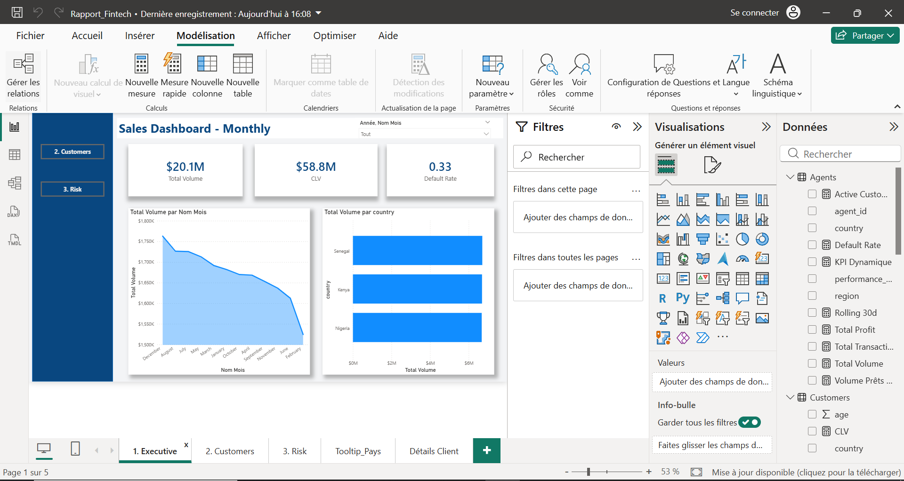
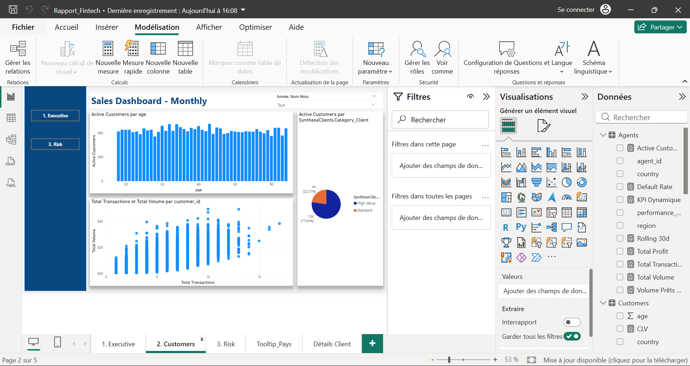
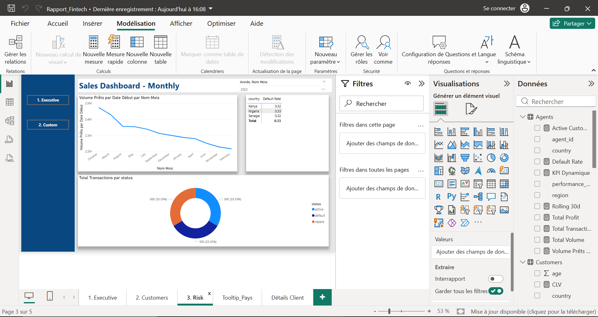

Projet : Système d'Analyse Fintech & Risque de Crédit

    Contexte du Projet

        Ce projet simule une mission de Data Analyst au sein d'une entreprise Fintech spécialisée dans le prêt et les transactions. L'objectif était de transformer des données brutes hétérogènes (Transactions, Prêts, Clients, Agents) en un outil d'aide à la décision pour le COMEX (Comité de Direction).
        Le challenge consistait à gérer des volumes de données importants, à automatiser le nettoyage et à fournir des indicateurs de performance (KPIs) avancés tout en garantissant la sécurité des données sensibles.

    Étapes de Réalisation (Workflow Technique)

        PARTIE 1 : Power Query (M) Avancé & ETL

            L'accent a été mis sur l'automatisation et l'optimisation de la mémoire vive (RAM).

            Nettoyage Automatisé : Création d'une fonction M personnalisée (fn_NettoyageExpert) pour supprimer les lignes nulles et uniformiser les types de données sur toutes les tables.
        
            Calendrier Dynamique : Génération d'une table DimDate en M, basée sur les dates min/max de la table Transactions.
        
            Logique Métier : Création d'une colonne de segmentation client (High Value vs Standard) basée sur le volume transactionnel total via une fusion de requêtes optimisée.
        
            Optimisation : Désactivation du chargement des tables intermédiaires pour alléger le modèle.

        PARTIE 2 : Modélisation des Données (Star Schema)

            Construction d'un modèle robuste type "Flocon" (Snowflake) et "Étoile" (Star Schema).

            Architecture : Tables de faits (FactTransactions, FactLoans) et tables de dimensions (DimCustomer, DimDate, DimAgents).
        
            Gestion des Dates : Mise en place d'une relation inactive entre DimDate et la date de début des prêts pour gérer plusieurs axes temporels sans créer d'ambiguïté.
        
            Hiérarchies : Création d'une hiérarchie géographique (Country > Region > City) pour le drill-down.

        PARTIE 3 : DAX Avancé

            Développement de mesures complexes pour analyser la rentabilité et le risque.

            Customer Lifetime Value (CLV) : Somme du volume transactionnel et des capitaux prêtés.
    
            Taux de Défaut (Default Rate) : Ratio dynamique des prêts en défaut via la fonction DIVIDE.
    
            Analyse Temporelle : Mesure de tendance sur 30 jours glissants (Rolling 30 days).
            
            Paramétrage Dynamique : Utilisation de SWITCH et SELECTEDVALUE pour permettre à l'utilisateur de changer de KPI (Volume ou Taux de défaut) sur un seul graphique.

        PARTIE 4 : Visualisation & UI/UX 

            Conception d'un dashboard de 3 pages avec un design "Fintech" moderne.

            Executive Dashboard : Vision macro avec KPI cards et ranking pays.
            
            Customer Insights : Analyse de la segmentation et nuage de points sur le comportement transactionnel.
            
            Risk & Credit : Heatmap de risque par pays et suivi des défauts.
            
            Interactivité : Navigation par boutons, Tooltips personnalisés (infobulles dynamiques) et Drill-through pour accéder aux détails d'un client spécifique.

        PARTIE 5 : Gouvernance & Sécurité

            Row Level Security (RLS) : Configuration de rôles dynamiques permettant aux managers de ne voir que les données relatives à leur pays respectif.

            Insights Business Extraits

            Concentration du Risque : Identification des zones géographiques où le taux de défaut dépasse le seuil critique de 5%.
            
            Rentabilité Client : La catégorie "High Value" génère 70% du profit net tout en représentant seulement 20% de la base client.
            
            Tendance : Corrélation observée entre l'augmentation du volume de prêts et la baisse du volume transactionnel sur certains segments.

    Contenu du Repository

        Rapport_Fintech.pbix : Le fichier Power BI complet.
        
        /Documentation : Captures d'écran du modèle de données et du dashboard final.
        
        Measures_DAX.txt : Liste exhaustive des formules DAX utilisées.

    Comment utiliser ce projet ?

        Téléchargez le fichier .pbix.
        
        Ouvrez-le avec Power BI Desktop.
        
        Explorez la navigation via les boutons et testez le sélecteur de KPI dynamique.

    ### Aperçu du Dashboard - Page Executive
            
            

    ### Aperçu du Dashboard - Page Customer
            
            

    ### Aperçu du Dashboard - Page Risk
            
            

Antony Asseko - Data Analyst
